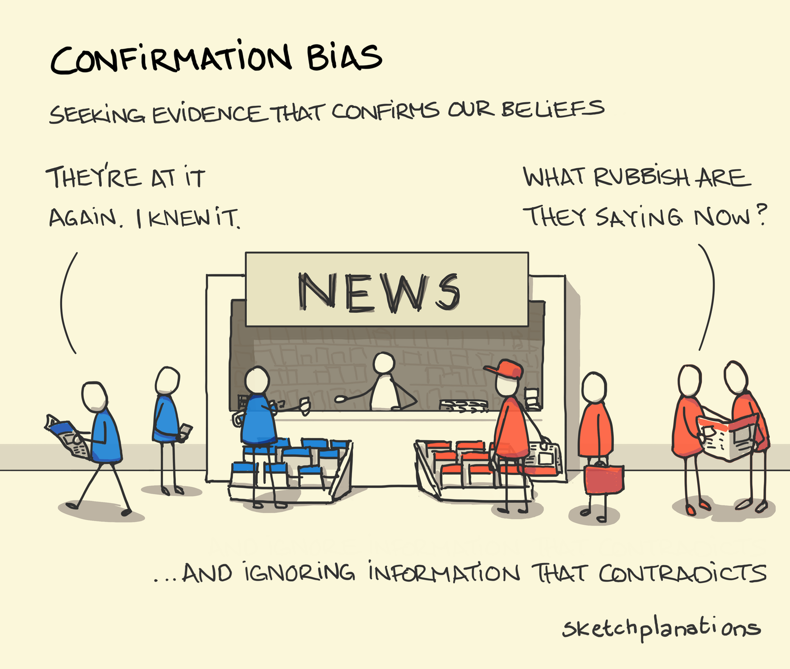

```{r setup, include=FALSE}
options(htmltools.dir.version = FALSE)
knitr::opts_chunk$set(out.width="80%", fig.align = "center")

# remotes::install_github("mitchelloharawild/icons")
# download_fontawesome()

library(icons)
library(knitr)
library(ggplot2)

theme.fom <- theme_classic(22*1.04)
theme.fom <- theme.fom
theme_set(
  theme.fom  
)

```

```{r xaringan-themer, include=FALSE, warning=FALSE}
library(xaringanthemer)

style_xaringan(
  header_color = "#00998A",
  inverse_background_color = "#00998A",
  footnote_font_size = "0.7rem",
  background_color = "#f3f3f3",
  base_font_size = "24px",
  text_font_size = "1.2rem",
  colors =c(
    grey = "#5E6974",
    green = "#0F710B",
    red = "#F34213",
    blue = "#0000FF",
    orange = "#FF8811",
    violet = "#DA70D6",
    purple = "#7A378B",
    olive = "#808000",
    fom = "#00998A")
  )
```


```{r dags, include=FALSE}
library(ggdag)

# DAGs in Motivation
co <- data.frame(x=c(0,0,1), y=c(0,1,0), name=c("X", "Z", "Y"))
DAG_chain <- dagify(Z ~ X,
                   Y ~ X,
                   Y ~ Z, coords = co) %>% 
  ggdag() + 
  geom_dag_point(colour = c("#0F710B", "#DA70D6", "#0000FF")) + 
  geom_dag_text(size = 8) +
  theme_dag_blank() +
  geom_dag_edges(arrow_directed = grid::arrow(length = grid::unit(15, "pt"), type = "closed"))

DAG_gender <- dagify(Z ~ X,
                   Y ~ X,
                   Y ~ Z, coords = co) %>% 
  ggdag() + 
  geom_dag_point(colour = c("#0F710B", "#DA70D6", "#0000FF")) + 
  geom_dag_text(size = 8) +
  theme_dag_blank() +
  geom_dag_edges(arrow_directed = grid::arrow(length = grid::unit(15, "pt"), type = "closed"))  +  
  geom_text(label = "X - Gender\nZ - Management\nY - Salary", 
            hjust = 1, vjust = 1,
            x = 1, y = 1, size = 7, color = "darkgrey")

DAG_fork <- dagify(X ~ Z,
                   Y ~ X,
                   Y ~ Z, coords = co) %>% 
  ggdag() + 
  geom_dag_point(colour = c("#0F710B", "#DA70D6", "#0000FF")) + 
  geom_dag_text(size = 8) +
  theme_dag_blank() +
  geom_dag_edges(arrow_directed = grid::arrow(length = grid::unit(15, "pt"), type = "closed"))

DAG_lifestyle <- dagify(X ~ Z,
                   Y ~ X,
                   Y ~ Z, coords = co) %>% 
  ggdag() + 
  geom_dag_point(colour = c("#0F710B", "#DA70D6", "#0000FF")) + 
  geom_dag_text(size = 8) +
  theme_dag_blank() +
  geom_dag_edges(arrow_directed = grid::arrow(length = grid::unit(15, "pt"), type = "closed"))  + 
  geom_text(label = "X - Lifestyle\nZ - Management\nY - Salary", 
            hjust = 1, vjust = 1,
            x = 1, y = 1, size = 7, color = "darkgrey")
```

```{r data, include=FALSE}
library(tidyverse)
library(mosaic)
library(kableExtra)
library(cowplot)
library(easyalluvial)
library(parcats)
Conclusion <- read.csv2("../Data/Conclusion.csv")
```

class: center, inverse, middle

# Intro

---

## Motivation

[Thomas Lumley](https://notstatschat.rbind.io/2021/05/02/generalisability-prediction-and-causation/) put it:

> In causal inference you choose your model so that one of the coefficients means what you want it to mean.


.fom[**Questions**:]

1. What do students think the data means? Does it depend on context?

2. Which model do students assume generated the data? Does it depend on context?

3. Can Directed Acyclic Graphs help to match (1) and (2)?

---

## Data Literacy

.center[
```{r dl-framework, out.width='68%', echo=FALSE}
include_graphics(c("img/DLF.jpg"))
```
]

.footnote[Source: [Schüller (2020)](https://hochschulforumdigitalisierung.de/sites/default/files/dateien/HFD_AP_Nr_53_Data_Literacy_Framework.pdf), cf. [Data Literacy Charter](https://www.stifterverband.org/data-literacy-charter)]


---

## A Wobbly Bridge

From *A1: Data Use Case* to *F2: Act Data-Driven*:


.center[<iframe src="https://giphy.com/embed/zQxOLmztiIWOs" width="480" height="350" frameBorder="0" class="giphy-embed" allowFullScreen></iframe>]

.footnote[[via GIPHY](https://giphy.com/gifs/animal-monkey-gibbon-zQxOLmztiIWOs)]


---

## The Wrong Lesson


[Danny Kaplan](https://cause.vmhost.psu.edu/cause/sites/default/files/uscots/uscots13/opening/6_Daniel_Kaplan.pdf):

> *What I was saying ...*
Data don’t speak, they inform our judgment.
Interpret data in the context of a whole system.

--

> *What they were hearing ...*
The data will say anything you want, depending on how you cut it.

--

<br> 

.center[.fom[How can we provide a framework to discuss science with data with all stakeholders?]]


---

class: center, inverse, middle

# An Example

---

## Gender Pay Gap (I/II)

Payment in fictitious company:


|                    | female      | male        |
|--------------------|-------------|-------------|
| **non-management** | 3100 (n=80) | 3000 (n=60) |
| **management**     | 5850 (n=20) | 5500 (n=40) |


.footnote[Example adopted from [Paul Hünermund](https://youtu.be/6ZwarKVgAzQ).]

---

## Gender Pay Gap (II/II)

What do you think is the magnitude of the gender pay gap for women in this company?

<br>

.olive[**A**]. On average: $\frac{3100 \cdot 80 + 5850 \cdot 20}{80+20}-\frac{3000 \cdot 60 + 5500 \cdot 40}{60+40}=-350$

.olive[**B**]. Adjusted for job: $\frac{(3100-3000) \cdot (80+60)}{200}-\frac{(5850-5500) \cdot(20+40)}{200}=+175$

---

## Lifestyle Pay Gap (I/II)

Payment in fictitious company:


|                    | healthy lifestyle | unhealthy lifestyle |
|--------------------|-------------------|---------------------|
| **non-management** | 3100 (n=80)       | 3000 (n=60)         |
| **management**     | 5850 (n=20)       | 5500 (n=40)         |

.footnote[Example adopted from [Paul Hünermund](https://youtu.be/6ZwarKVgAzQ).]

---

## Lifestyle Pay Gap (II/II)


What do you think is the magnitude of the healthy pay gap in this company?

<br> 

.olive[**A**]. On average: $\frac{3100 \cdot 80 + 5850 \cdot 20}{80+20}-\frac{3000 \cdot 60 + 5500 \cdot 40}{60+40}=-350$

.olive[**B**]. Adjusted for job: $\frac{(3100-3000) \cdot (80+60)}{200}-\frac{(5850-5500) \cdot(20+40)}{200}=+175$

---

## Different Data Stories

.pull-left[
Directed Acyclic Graphs (DAG) tell your assumed *data story* - and tell you if you should adjust for $\color{violet}{Z}$ to estimate the total causal effect of exposure $\color{green}{X}$ on outcome $\color{blue}{Y}$.]

.pull-right[
```{r,echo=FALSE, fig.width=8, fig.height=4, out.width='100%', fig.align='center', warning=FALSE}
plot_grid(DAG_fork,DAG_chain, ncol=2, nrow = 1,  label_size=12,
          labels=c('Z in a fork between X and Y',
                   'Z in a chain between X and Y'))
```
]

---

## Simpson's Paradox

.center[<iframe width="560" height="315" src="https://www.youtube.com/embed/nGqzoqXZch0" title="YouTube video player" frameborder="0" allow="accelerometer; autoplay; clipboard-write; encrypted-media; gyroscope; picture-in-picture" allowfullscreen></iframe>]

.footnote[[Rafael Moral: Summary Song #8 - Simpson's Paradox](https://youtu.be/nGqzoqXZch0) (Winner of CAUSE 2021 A-µ-Sing Competition)]

---

class: center, inverse, middle

# Empirical Study

---

## Survey

Online survey with two randomized experimental factors:

- Context / Exposure: gender or lifestyle

- Order of task presentation: DAG or table and effect estimation first

Sample: $n = `r nrow(Conclusion)`$ business psychology students studying while working within a marketplace for scientific studies. .fom[As the study program is offered for professionals, students may already be in a management position. No formal training in causal inference.]

---

## Exposure: Gender

.pull-left[
- Presumably (.red[**!**]) .violet[managment] mediator between .green[gender] and .blue[salary]: *Chain*.

- Then *unadjusted* mean would reveal total causal effect of .green[gender] on .blue[salary].
]

.pull-right[
```{r,echo=FALSE, out.width='80%', fig.align='center'}
DAG_gender
```
]

---

## Choices: Gender

.pull-left[
**Table first**:

```{r,echo=FALSE,, out.width='95%', fig.asp=0.6, fig.align='center'}
pA1 <- Conclusion %>%
  filter(type == "A1") %>%
  select(adjusted, graph) %>%
  alluvial_wide()
parcats(pA1, marginal_histograms = FALSE)
```
]

.pull-right[
**DAG first**:

```{r,echo=FALSE,, out.width='95%', fig.asp=0.6, fig.align='center'}
pA2 <- Conclusion %>%
  filter(type == "A2") %>%
  select(graph, adjusted) %>%
  alluvial_wide()
parcats(pA2, marginal_histograms = FALSE)
```
]

---

## Exposure: Lifestyle

.pull-left[
- Presumably (.red[**!**]) .violet[managment] confounder between .green[lifestyle] and .blue[salary]: *Fork*.

- Then *adjusted* mean would reveal causal effect of .green[lifestyle] on .blue[salary].
]

.pull-right[
```{r,echo=FALSE, out.width='80%', fig.align='center'}
DAG_lifestyle
```
]

---

## Choices: Lifestyle

.pull-left[
**Table first**:

```{r,echo=FALSE,, out.width='95%', fig.asp=0.6, fig.align='center'}
pD1 <- Conclusion %>%
  filter(type == "D1") %>%
  select(adjusted, graph) %>%
  alluvial_wide()
parcats(pD1, marginal_histograms = FALSE)
```
]

.pull-right[
**DAG first**:

```{r,echo=FALSE,, out.width='95%', fig.asp=0.6, fig.align='center'}
pD2 <- Conclusion %>%
  filter(type == "D2") %>%
  select(graph, adjusted) %>%
  alluvial_wide()
parcats(pD2, marginal_histograms = FALSE)
```
]

---
## Summary: Effect

.center[**Proportion who choose adjusted mean:**]

```{r table2, echo=FALSE, message=FALSE}
Conclusion %>%
  group_by(exposure, dag.first) %>%
  summarise(prop.adjusted = sum(adjusted)/n()) %>%
  ungroup() %>%
  mutate(prop.adjusted = round(prop.adjusted,2)) %>%
  pivot_wider(id = exposure, names_from = dag.first, values_from = prop.adjusted) %>%
  rename("table first" =`FALSE`, "dag first" = `TRUE`) %>%
  kbl() %>%
  column_spec(1, bold = TRUE)
```

For both exposures the arguably right answer (unadjusted mean for gender, adjusted mean for lifestyle) is chosen more often if the DAG is presented first.

---

## Summary: Model

.center[**Proportion who choose fork as graphical model:**]

```{r table3, echo=FALSE, message=FALSE}
Conclusion %>%
  group_by(exposure, dag.first) %>%
  summarise(prop.fork = sum(graph == "Fork")/n()) %>%
  ungroup() %>%
  mutate(prop.fork = round(prop.fork,2)) %>%
  pivot_wider(id = exposure, names_from = dag.first, values_from = prop.fork) %>%
  rename("table first" =`FALSE`, "dag first" = `TRUE`) %>%
  kbl() %>%
  column_spec(1, bold = TRUE)
```

For exposure gender setting only a chain is appropriate, whereas the model for lifestyle both might be true with arguably a fork being more plausible.

---

## Summary: Consistency

.center[**Proportion consistent choices:**]

```{r table4, echo=FALSE, message=FALSE}
Conclusion %>%
  group_by(exposure, dag.first) %>%
  summarise(prop.consistent = sum(consistent)/n()) %>%
  ungroup() %>%
  mutate(prop.consistent = round(prop.consistent,2)) %>%
  pivot_wider(id = exposure, names_from = dag.first, values_from = prop.consistent) %>%
  rename("table first" =`FALSE`, "dag first" = `TRUE`) %>%
  kbl() %>%
  column_spec(1, bold = TRUE)
```

The consistency of both choices (adjusted or unadjusted mean as estimated effect and covariable management in the middle of a fork or a chain) is rather low.

---

class: center, inverse, middle

# Outro

---

class: center
background-image: url("img/RedBlue-Causal.jpg")

---

## If you've just woken up

<br> 

.center[Draw (Causal) Conclusions from Data – Some Evidence]

`r icon_style(fontawesome("hand-point-right", style = "solid"), fill = "#00998A")` Conclusions from data depend on the qualitative assumptions about the data generating process. Data alone is not enough and we should try to make our assumptions as transparent and discussible as possible, and integration of DAGs in data science education may be a step in that direction. More research is needed.

---

## Outlook

.pull-left[
.fom[Ongoing research]: Conclusions may be even more messy then presented here if data does not meet expectations, e.g. when women are favored in terms of the gender pay gap.`r fontawesome("sad-tear", style = "solid")`
]

.pull-right[
```{r confibias, out.width='80%', echo=FALSE, fig.align='center'}

```

.footnote[Source: [Sketchplanations](https://sketchplanations.com/confirmation-bias)]
]

---

## The End

.center[`r icon_style(fontawesome("heart", style = "solid"), fill = "#F92672")` Thank you for your participation `r icon_style(fontawesome("heart", style = "solid"), fill = "#F92672")`]

<br>

- `r fontawesome$brands$github` (Source and data):  [https://github.com/luebby/CDSM21](https://github.com/luebby/CDSM21)

<br>

- `r fontawesome("envelope", style = "solid")`:  [karsten.luebke@fom.de](<mailto:karsten.luebke@fom.de>)
- `r fontawesome("twitter", style = "brands")`:  [@luebby42](https://twitter.com/luebby42)
